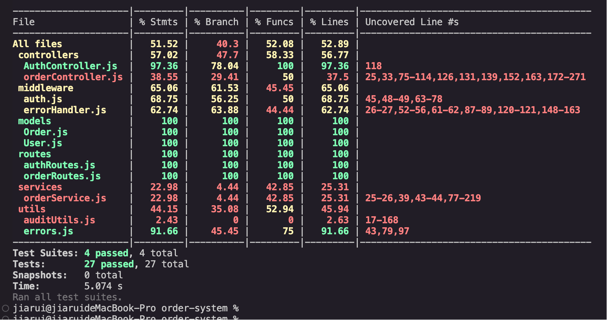

# 订单系统

基于Node.js和MongoDB的完整订单管理系统，支持用户认证、订单管理、统一错误处理和测试框架，实用华为云FunctionGraph部署。

## 功能特性

- **用户管理**：注册、登录、JWT认证
- **订单管理**：创建、查询、更新、取消订单
- **权限控制**：基于角色的访问控制
- **统一错误处理**：标准化的错误响应机制
- **数据验证**：请求参数验证
- **完整测试框架**：单元测试和集成测试
- **支持MongoDB数据库**：使用Mongoose ODM
- **兼容华为云FunctionGraph**：支持云函数部署

## 技术栈

- **核心框架**：Node.js, Express.js
- **数据库**：MongoDB, Mongoose
- **认证**：JWT 
- **错误处理**：自定义错误类库
- **测试**：Jest, Supertest, MongoDB Memory Server
- **云部署**：华为云FunctionGraph

## 快速开始

### 安装依赖

```bash
npm install
```

### 配置环境变量

项目提供了多个环境配置文件：
- `.env.dev`：开发环境
- `.env.uat`：测试环境
- `.env.prod`：生产环境

根据需要复制并修改环境变量：

```bash
cp .env.dev .env
```

主要配置项：
- `MONGODB_URI`: MongoDB连接地址
- `PORT`: 服务器端口（默认3000）
- `JWT_SECRET`: JWT签名密钥
- `NODE_ENV`: 运行环境

### 启动服务

#### 开发模式
```bash
npm run dev
```

#### 生产模式
```bash
npm start
```

服务将在配置的端口上运行（默认3000）。

## API文档

### 认证相关

- **POST /api/auth/register**
  - 用户注册
  - 请求体：`{"username": "...", "email": "...", "password": "..."}`

- **POST /api/auth/login**
  - 用户登录
  - 请求体：`{"username": "...", "password": "..."}`
  - 返回：JWT令牌和用户信息

### 订单管理

- **POST /api/orders** (需要认证)
  - 创建新订单
  - 请求体：`{"products": [...], "shippingAddress": {...}, "paymentMethod": "..."}`

- **GET /api/orders/:id** (需要认证)
  - 获取订单详情
  - 参数：订单ID

- **GET /api/orders** (需要认证)
  - 获取用户订单列表
  - 查询参数：limit, page, status

- **PUT /api/orders/:id/status** (需要管理员权限)
  - 更新订单状态
  - 请求体：`{"status": "pending|processing|shipped|delivered|cancelled"}`

- **PUT /api/orders/:id/cancel** (需要认证)
  - 取消订单
  - 仅待处理订单可取消

- **GET /api/orders/admin** (需要管理员权限)
  - 获取所有订单（管理员功能）

### 健康检查

- **GET /health**
  - 检查服务是否正常运行

## 统一错误处理

系统实现了完善的错误处理机制，提供标准化的错误响应格式：

```json
{
  "success": false,
  "message": "错误消息",
  "errorCode": "ERROR_CODE",
  "path": "/request/path",
  "details": { /* 可选的详细错误信息 */ }
}
```

支持的主要错误类型：
- BadRequestError：请求参数错误
- NotFoundError：资源未找到
- UnauthorizedError：未授权访问
- ForbiddenError：禁止访问
- ValidationError：数据验证错误
- InternalServerError：服务器内部错误

## 测试

### 运行测试

```bash
# 运行所有测试
npm test

# 运行单个测试文件
npm test -- tests/simple.test.js

# 监视模式
npm run test:watch
```

### 测试覆盖率

测试命令会自动生成覆盖率报告，保存在 `coverage/` 目录下。

本地测试报告示例：


## 项目结构

```
order-system/
├── config/           # 配置文件
│   └── database.js   # 数据库配置
├── controllers/      # 控制器
│   ├── AuthController.js    # 认证控制器
│   └── orderController.js   # 订单控制器
├── middleware/       # 中间件
│   ├── auth.js              # 认证中间件
│   └── errorHandler.js      # 错误处理中间件
├── models/           # 数据模型
│   ├── User.js              # 用户模型
│   └── Order.js             # 订单模型
├── routes/           # 路由
│   ├── authRoutes.js        # 认证路由
│   └── orderRoutes.js       # 订单路由
├── services/         # 服务层
│   └── orderService.js      # 订单服务
├── utils/            # 工具类
│   ├── auditUtils.js        # 审核工具类
│   └── errors.js            # 错误类库
├── tests/            # 测试目录
│   ├── controllers/         # 控制器测试
│   ├── middleware/          # 中间件测试
│   └── simple.test.js       # 简单测试用例
├── test/             # 测试配置
│   └── setup.js             # 测试环境设置
├── scripts/          # 脚本文件
│   ├── build.sh             # 构建脚本
│   └── deploy.sh            # 部署脚本
├── .env              # 环境变量
├── .env.dev          # 开发环境配置
├── .env.uat          # 测试环境配置
├── .env.prod         # 生产环境配置
├── .gitignore        # Git忽略文件
├── index.js          # 应用入口
├── package.json      # 项目配置
├── Dockerfile        # Docker配置
├── docker-compose.yml # Docker Compose配置
├── Jenkinsfile       # CI/CD配置
└── README.md         # 项目文档
```

## 华为云FunctionGraph部署

1. 打包项目：
   ```bash
   zip -r order-system.zip .
   ```

2. 登录华为云控制台，创建FunctionGraph函数。

3. 上传打包的zip文件。

4. 配置函数入口：`index.handler`

5. 设置环境变量（与.env文件内容一致）。

6. 配置触发器（如API网关）。

## Docker部署

使用Docker Compose快速部署：

```bash
docker-compose up -d
```

## CI/CD配置

项目包含Jenkinsfile，支持CI/CD自动化部署。主要流程：
1. 代码拉取
2. 依赖安装
3. 运行测试
4. 构建Docker镜像
5. 部署到目标环境

## 注意事项

1. 部分代码使用伪代码实现，比如审核，需要根据实际业务需求实现，如果有现成的工作流，可以接入并且在审核工具类中实现。
2. 没有设计用户角色，默认用户直接可以操作数据，没有权限控制。后续有新设计可以改造接入。
3. 打包、编译可以改造成用gulp方式，进程管理也可以改成使用pm2。如果有需要可以随时修改。

